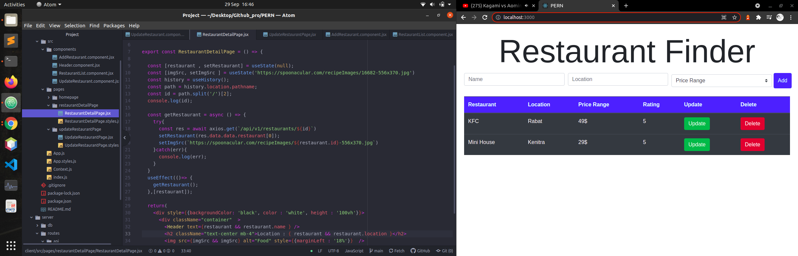

# PERN

## Stack : PostgreSQL  , ExpressJS , React , NodeJs



**Install dependencies and Run Project**

```
  npm install
  npm run client
  npm run dev

```


**Postgres Useful Command**

  * Enter to Postgres CLI
  * > sudo -u postgres psql
  * list all databases
  * > \l
  * create new database
  * > CREATE DATABASE database_name ;
  * connect to a new database
  * > \c database_name
  * create new tables in a database
  * ```
    CREATE TABLE table_name (
      column_name TYPE column_constraint
    )
      ```
  * show all tables in db
  * > \d
  * describe a table
  * > \d table_name
  * delete database
  * > DROP DATABASE db_name


<!--

DROP TABLE restaurants;

CREATE TABLE restaurants (
  id BIGSERIAL NOT NULL PRIMARY KEY,
  name VARCHAR(50)NOT NULL,
  location VARCHAR(50)NOT NULL,
  price_range INT NOT NULL check(price_range>= 1 and price_range <= 50)
);

INSERT INTO restaurants(name , location , price_range) VALUES ('KFC','Rabat',49);

INSERT INTO restaurants(name , location , price_range) VALUES ('Mini House','Kenitra',29);

SELECT * FROM restaurants;

-->
